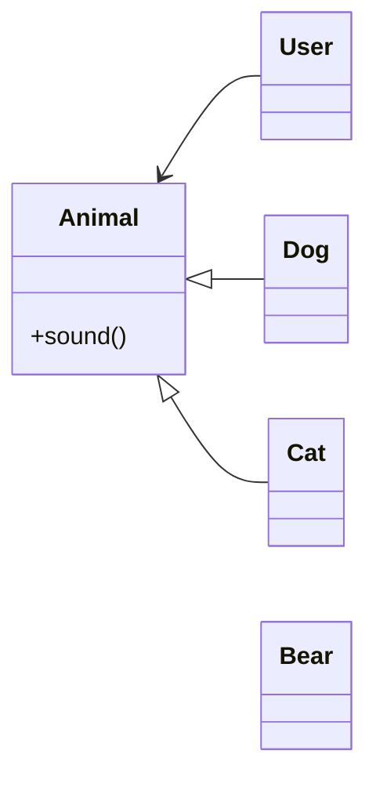
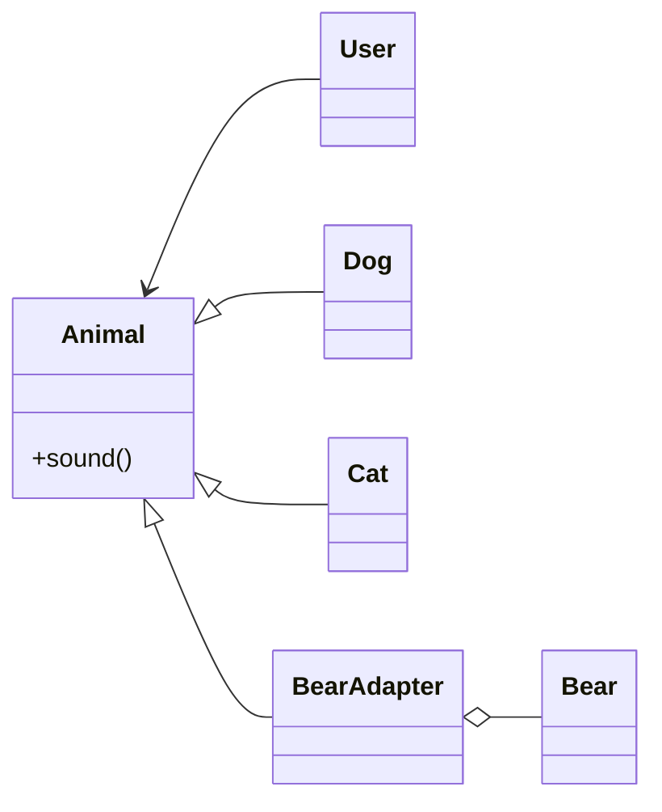

# **Adapter**

어댑터는 어떤 클래스를 사용하는데 그 클래스의 코드를 변경할 수 없는 상황일 때 원하는 형태로 사용할 수 있게 해줍니다.

아래와 같은 클래스 다이어그램이 있다고 해봅시다.

이때 Bear 클래스가 Animal 클래스를 상속받으려고 하는데 코드를 변경할 수 없는 상황이라면  
Bear 클래스 대신에 BearAdapter가 Animal 클래스를 상속받고 Bear 클래스의 객체를 BearAdapter의 필드로 들어가게 할 수 있다.

이런 패턴을 어댑터 패턴이라고 한다.

클래스의 코드를 변경하기 어려운 경우는 다음과 같습니다.

- 이미 많은 곳에서 사용되는 클래스로써 변경하면 영향을 많이 끼치는 경우
- 어떤 클래스의 버전이 올라간 경우, 상위버전 클래스와 하위버전 클래스 둘 다 지원해야 하는 경우
