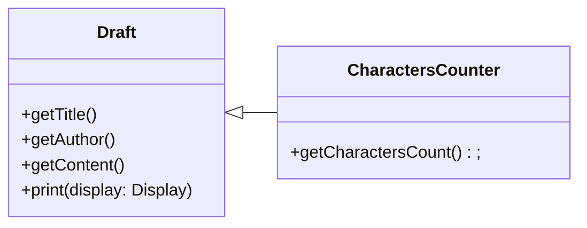
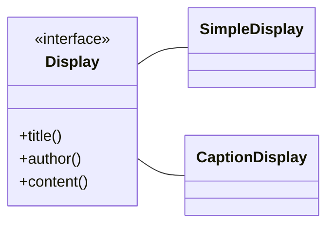
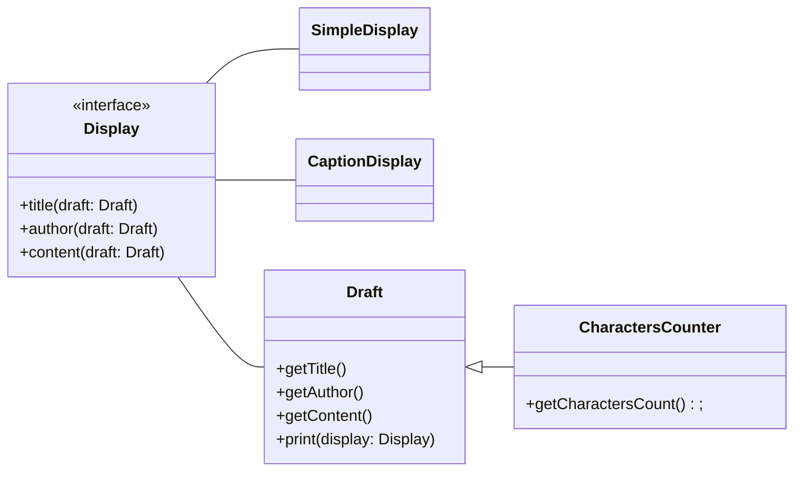

# **Bridge**

브릿지는 기능 계층(메서드 추가 계층)과 구현 계층(인터페이스 구현 계층)의 분리로 시스템 확장성과 유지보수성을 높이는 패턴입니다.

## **기능 계층**

기능 계층은 상속받은 클래스에 새로운 기능의 메서드를 추가하는 것을 말합니다.

예를 들어 Draft라는 클래스에서 조사의 개수를 세는 기능이 필요하다면 아래처럼 새로운 CharactersCounter 클래스를 만들어 Draft를 상속받게 하는 것입니다.

## **구현 계층**

구현 계층은 인터페이스 구현 또는 추상 클래스 상속을 통해 이미 선언된 메서드를 구현하는 것을 말합니다.  
때문에 아래처럼 메서드를 구현해 확장할 수 있습니다.

이 두 계층을 연결하면 다음처럼 만들어집니다.

위처럼 생긴 패턴을 브릿지 패턴이라고 합니다.

위 다이어그램에서 Draft는 제목, 저자, 내용에 대한 데이터를 저장하는 클래스이고 Display 인터페이스를 통해 그 데이터를 출력합니다.

## **정리**

브릿지 패턴은 기능 계층을 확장해 새로운 구현을 추가할 때, 구현 계층을 확장함으로써 복잡도를 효과적으로 낮출 수 있습니다.

브릿지 패턴에서 기능 계층과 구현 계층가 통신할 땐 위임을 통해 통신을 합니다.  
위 다이어그램에서 Draft의 print() 메서드의 출력 기능을 인자인 Display 객체에 위입하고 있고,  
Display 인터페이스는 출력할 데이터를 얻기 위해 인자인 Draft 객체에 위입하고 있습니다.

또한 브릿지 패턴은 클래스들 간의 관계를 단순하게 유지시켜 좋게 만들어줍니다.
