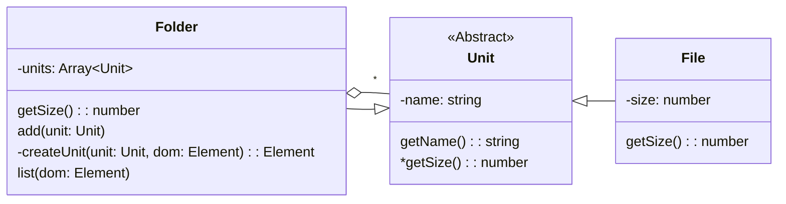

# **Composite**

Composite 패턴은 집합체와 집합체를 구성하는 단일체를 같은 개념으로 처리하는 패턴입니다.  
때문에 집합체 내에 집합체가 올 수 있습니다.

아래와 같이 폴더와 파일 클래스로 예시를 들 수 있습니다.

Folder 클래스에 units에는 Unit을 상속받은 Folder와 File이 올 수 있고 add()를 통해 Folder나 File 객체를 추가할 수 있습니다.

createUnit() 과 list() 메서드는 화면에 구조를 띄우는 기능을 담당합니다.

Unit 클래스에 getName은 폴더나 파일의 이름을 반환하고 getSize()는 Folder, File 클래스의 구현이 달라 추상 메서드로 되어 있습니다.

Composite 패턴에서 집합체와 단일체가 같은 개념으로 보기에 집합체를 또 또 다른 단일체로 정의할 수 있습니다.
