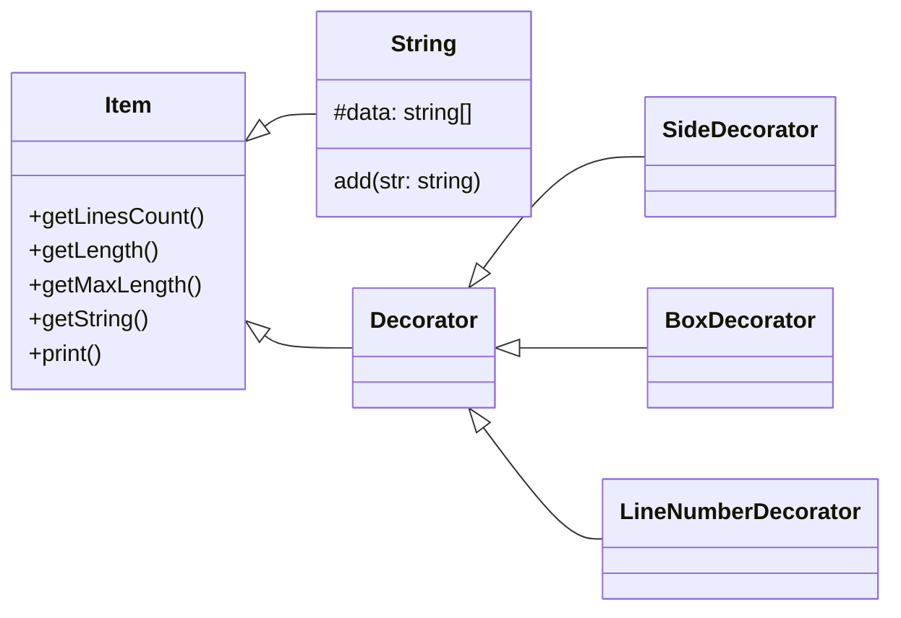

# **Decorator**

Decorator 패턴은 기능을 장식처럼 계속 추가할 수 있는 패턴입니다.  
아래는 Decorator 패턴의 예시 입니다.

위 다이어그램에서 Strings 클래스는 장식할 대상이 되는 data 배열에 문자열을 여러개 가지고 있습니다.  
그리고 추상 클래스인 Decorator를 상속받은 3개의 클래스는 Strings 클래스의 내용물을 꾸미는 클래스가 됩니다.

Decorator의 생성자에는 Item 타입의 객체, 여기선 Strings의 객체를 인자로 받고, Item 클래스의 메서드를 활용해 Strings의 내용물을 꾸밉니다.  
그리고 Decorator도 Item 클래스를 상속받고 있기 때문에 장식에 장식을 한번 더 추가할 수 있습니다.
