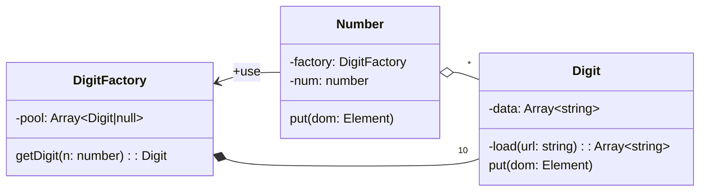

# **Flyweight**

Flyweight 패턴은 동일한 객체를 한번만 생성해 공유하여 사용할 수 있는 패턴입니다.

Number 클래스에서 num은 434331 같은 긴 숫자고  
put 메서드는 긴 숫자에 들어있는 숫자를 DigitFactory에 getDigit 메서드를 통해서 Digit을 가져와 dom에 출력하는 메서드입니다.

DigitFactory는 pool 프로퍼티에 Digit을 저장해 재활용합니다.  
이 DigitFactory 부분에서 Flyweight 패턴이 적용됩니다.

Flyweight 패턴에서 미리 생성한 객체는 공유의 개념으로 사용되므로 공유할 속성과 공유하지 않을 속성을 구분하여 설계해야 합니다.
