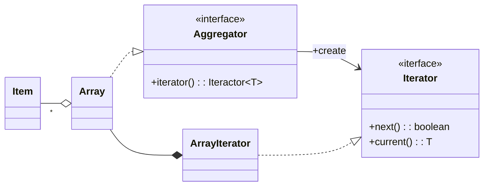

# **Iterator**

## **Container/Aggregator**

동일한 형태의 데이터 항목의 집합을 컨테이너 / 애그리게이터라고 합니다.

애그리게이터는 내부 자료구조에 따라 종류가 다양합니다.  
(Array, Linked List, Tree, Graph, Table, ...)

배열 어그리게이터는 다음 인터페이스들과 클래스들로 구현된다.

이때 Array와 ArrayIterator 대신 다른 어그레이터를 위한 클래스가 들어올 수도 있다.
