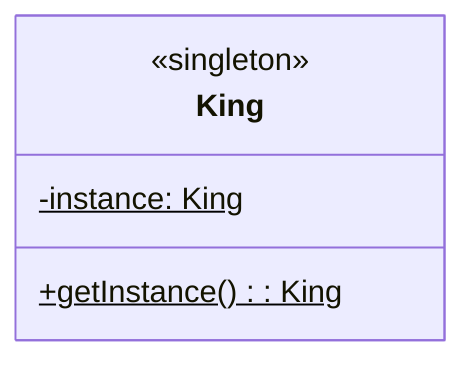

# **Singleton**

Singleton 패턴은 하나의 클래스에서 오직 하나의 객체만 생성되도록 하는 패턴입니다.  
이 싱글톤 패턴이 적용된 클래스를 다른 클래스들에서 접근은 할 수 있지만 생성은 하지 못합니다.

싱글톤 패턴을 클래스 다이어그램으로 나타내면 아래와 같습니다.

위 다이어그램에서 King 클래스는 싱글톤 패턴을 적용했다는 의미에서 스테레오 타입으로 singleton이 명시되어 있습니다.

instance 필드와 getInstance() 메서드에 밑줄은 해당 필드, 메서드가 static이라는 의미이고 앞에 -, + 기호는 각각 private, public이라는 의미입니다.
