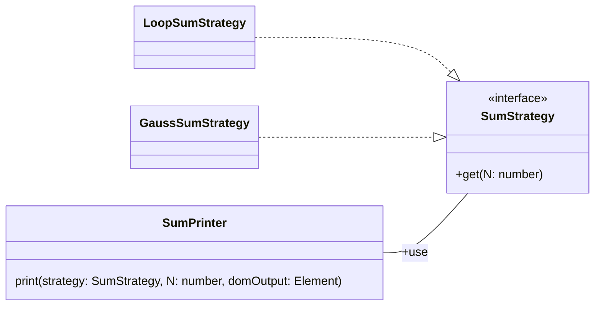

# **Strategy**

Strategy는 어떤 기능의 행위를 실행 중에 동적으로 변경할 수 있게 해주는 방안을 제공해줍니다.  
덕분에 어떤 기능에 대한 특정 알고리즘을 느슨하게 결합시켜줍니다.

이렇게 한다면 추후에 더 나은 알고리즘으로 쉽게 변경이 가능할 뿐 아니라 프로그램이 실행 중인 상황에 맞는 알고리즘으로 쉽게 변경할 수도 있습니다.

1부터 100까지 더한 수를 보여주는 SumPrinter와 인터페이스, 전략들의 관계는 다음처럼 구현됩니다.

