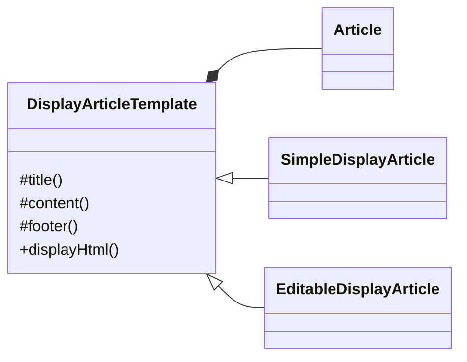

# **Template Method**

템플릿 메서드는 실행되어야 할 각 단계에 대한 순서만을 정해두고 세부적인 내용은 상황에 따라 다르게 구현할 수 있도록 하는 패턴입니다.

템플릿 메서드를 클래스 다이어그램으로 나타내면 다음과 같습니다.

이 다이어그램에서 DisplayArticleTemplate이라는 추상클래스를 SimpleDisplayArticle과 EditableDisplayArticle이 상속받아 세부적인 내용을 구현하고 있습니다.
